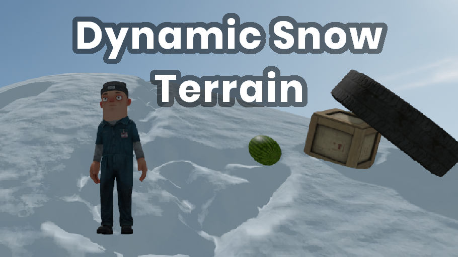
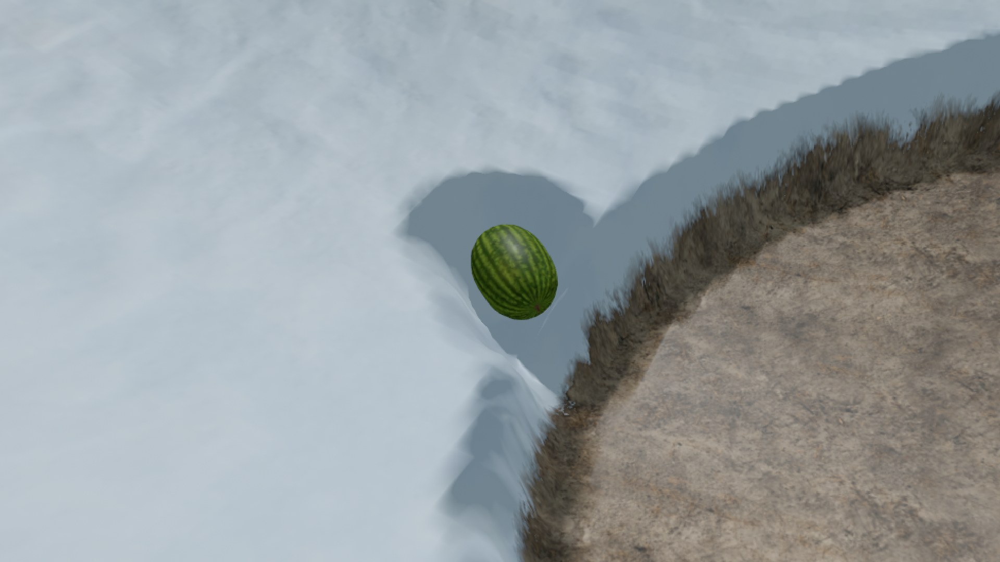
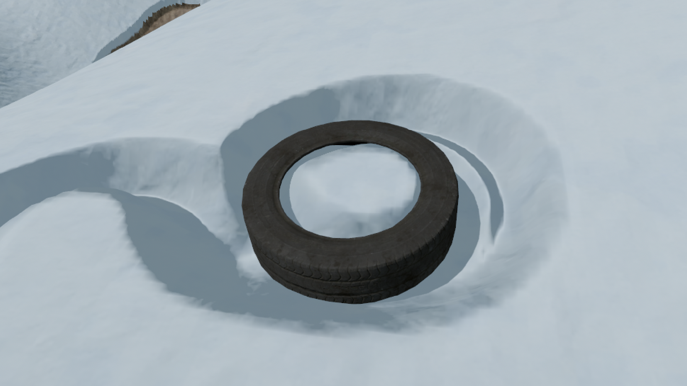
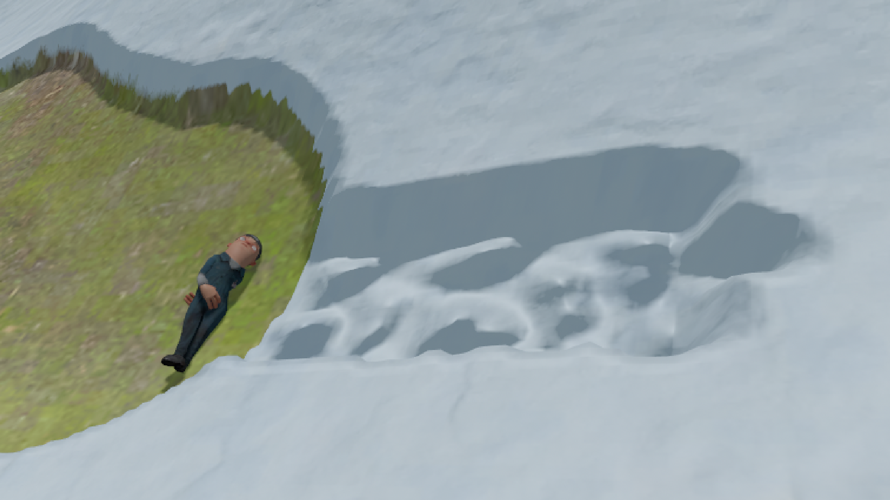
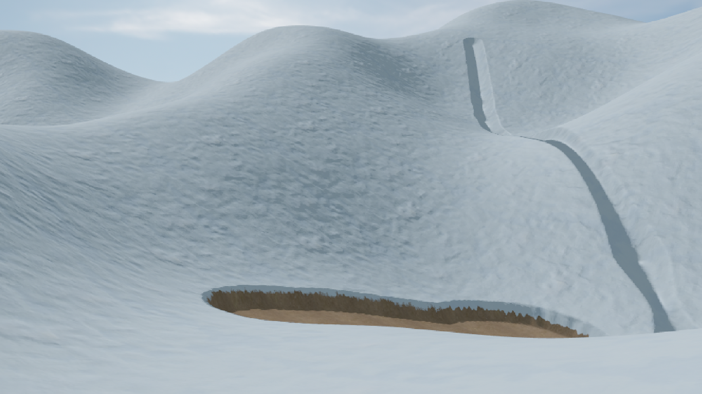
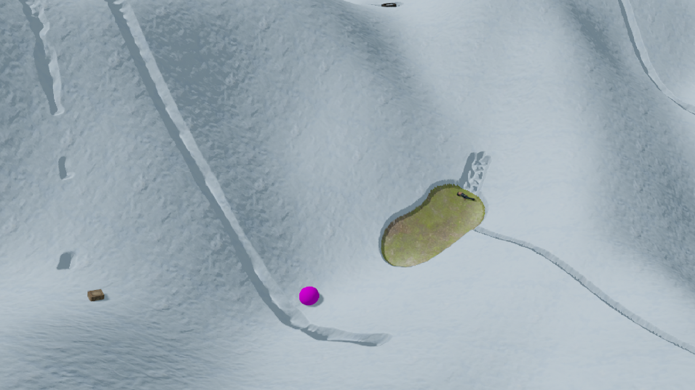

  

# Dynamic Snow Terrain

This project was submitted for the [S&box Tech Jam](https://sbox.game/c/tech1)

 

## Showcase:

  
  
  
  
  

### To adapt this a couple things should be considered:

- The snow texture must be the first one in the terrain materials list.
- Does not support multiplayer
- Ratio between snow height and terrain height must be 1:100

 

### If you still decided to use this:

1. Copy *Assets/shaders/terrain_snow* folder and *code/Snow/Terrain/SnowTerrainHandler.cs* into your project
2. The _TerrainHandler_ component has to be attached to your gameobject that has the terrain component
3. Assign the references in the _TerrainHandler_
4. In the terrain component's terrain materials list, the first texture is expected to be the snow material, the other three will be used to deform the snow
5. Should be ready to go
